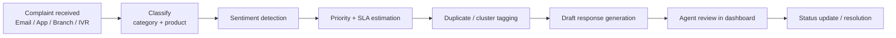
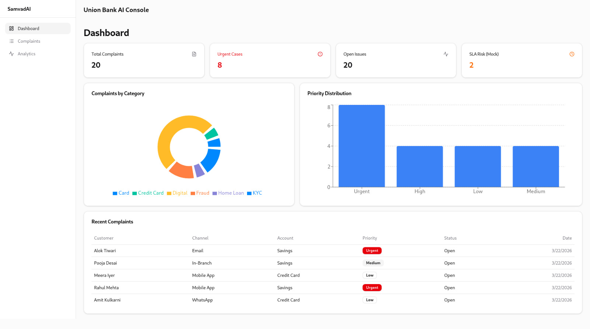
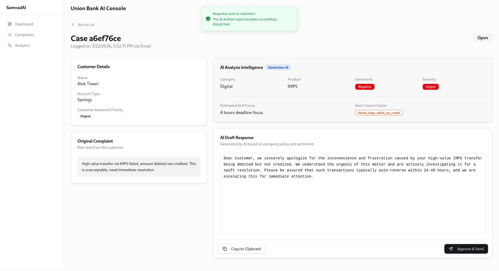

# SamvadAI
**SamvadAI is an AI-powered complaint operations platform that helps Union Bank teams triage complaints and draft responses faster.**

## Why this exists
Public sector banks handle a large volume of complaints across channels. Teams lose time sorting priority, checking duplicates, and writing responses manually.
SamvadAI reduces that effort by running each complaint through an AI pipeline and giving the agent a ready analysis plus draft response.

## How it works



## What’s inside

```text
SamvadAI/
├── apps/
│   ├── api/        # Django + Django-Ninja backend, models, API, AI pipeline
│   └── web/        # React + Vite frontend dashboard
├── shared/         # Shared TypeScript package (@samvad/shared)
├── docs/
│   ├── mkdocs.yml  # Docs site config
│   └── docs/       # All markdown docs
├── complaints.json # Seed dataset for local demo
└── README.md       # You are here
```

## Tech stack

| Layer | Tools |
|---|---|
| Backend API | Django, Django-Ninja |
| Database | SQLite |
| AI orchestration | LangGraph, LangChain |
| AI models | Gemini (`gemini-2.5-flash`), Ollama (`phi3`), Claude (`calude-haiku-4.5`) |
| Frontend | React, Vite, TypeScript |
| UI + State | shadcn/ui, Tailwind, TanStack Query, Zustand, Recharts |
| Docs | MkDocs (Material theme) |

## Screenshots

### Dashboard



### Complaint Detail



## Quickstart (local, 4 commands)

1) Backend setup + run:
```bash
cd apps/api && uv sync && uv run python manage.py migrate && uv run python manage.py seed_complaints && uv run python manage.py runserver 0.0.0.0:8000
```

2) Frontend setup + run (new terminal):
```bash
cd apps/web && npm install && npm run dev
```

3) Optional: Docs site (new terminal):
```bash
cd docs && uv run mkdocs serve -a 0.0.0.0:8001
```

4) Open:
- Frontend: http://localhost:5173
- API docs: http://localhost:8000/api/docs
- Django admin: http://localhost:8000/admin

## 📚 Documentation Index

### Getting started
- [Project Docs Home](docs/docs/index.md) — Fast overview of architecture, workflow, and where to start.
- [Documentation Sitemap](docs/docs/sitemap.md) — Quick navigation map of all docs pages.

### Architecture
- [Backend Architecture](docs/docs/backend.md) — Data model, API shape, and backend service flow.
- [Frontend Architecture](docs/docs/frontend.md) — UI modules, state flow, and page-level design.
- [AI Pipeline](docs/docs/ai-pipeline.md) — Step-by-step pipeline behavior from input to draft output.

### API
- [API Reference](docs/docs/api-reference.md) — Endpoint list, request/response examples, and common usage.

