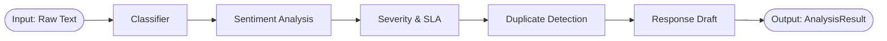

# Gen-AI Pipeline

SamvadAI uses a complex `LangGraph` state machine to guarantee deterministic and highly accurate data processing.

The graph executes sequentially for every incoming complaint.

## LangGraph Logic
The SamvadAI pipeline is a deterministic state machine orchestrated by `LangGraph`. This ensures that even for complex, non-linear reasoning, the processing flow is structured and testable.

## Node Algorithms

### 1. Classifier Node
**Algorithm**: Zero-shot Classification + Pydantic Parsing.
- Takes `raw_text`.
- Predicts `category` (Loan/Card/Digital/Branch/Fraud) and `product` (e.g. IMPS, KYC, ATM).
- Returns structured JSON to the graph state.

### 2. Sentiment Node
**Algorithm**: Emotional Tone Mapping.
- Extracts `tone` (Positive/Neutral/Negative/Hostile).
- Hostile sentiment triggers an automatic escalation flag for management.

### 3. Severity & SLA Node
**Algorithm**: Priority Scoring Matrix.
- Inputs `category` and `sentiment`.
- Urgent category + Negative sentiment = **Urgent** priority.
- Generates a **deadline timestamp** based on `sla_hours` (e.g., 4h for Urgent, 24h for Low).

### 4. Duplicate Detection Node
**Algorithm**: Vector-like semantic clustering (via few-shot LLM matching).
- Compares new complaint against `existing_clusters` fetched from SQLite.
- If a match is found, it labels the `cluster_tag` to group systemic bank outages (e.g., "ATM_DOWN_INDORE").

### 5. Draft Response Node
**Algorithm**: Contextual Templating.
- Combines the complaint text and AI insights to draft a professional, helpful support reply in the bank's brand voice.

## LLM Providers
SamvadAI is built with a dual-model fallback architecture:
1. **Cloud (Default)**: Uses Google Gemini 2.5 Flash via `langchain-google-genai`. This is the primary stable model for the cloud-connected dashboard.
2. **Local (Edge)**: Uses Microsoft Phi-3 via `Ollama`. This allows the bank's sensitive customer data to be processed entirely offline on internal infrastructure.

To toggle between them, set `USE_LOCAL_LLM=true` in the `.env` file.
