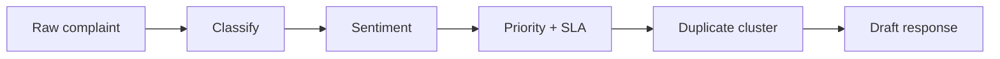

[Back to README](../../README.md)

# AI Pipeline
**This doc explains each step in the LangGraph pipeline from complaint text to drafted response.**

## Pipeline graph

## Step-by-step behavior

### 1) Classify
The model predicts complaint category and product area.

### 2) Sentiment
The model labels complaint tone (for example: neutral, negative, hostile).

### 3) Priority + SLA
The model estimates urgency and suggested SLA window.

### 4) Duplicate/cluster detection
The pipeline checks if this complaint resembles existing issue clusters.

### 5) Draft response
The model drafts a response text for human review.

## Model providers
You can switch between:
- **Gemini cloud** (`gemini-2.5-flash`)
- **Ollama local** (`phi3`)

Set this in environment config (for example `USE_LOCAL_LLM=true`).

## Why this design
The step-based pipeline keeps logic understandable and testable.
It also lets you swap a single step later without rewriting the full flow.

