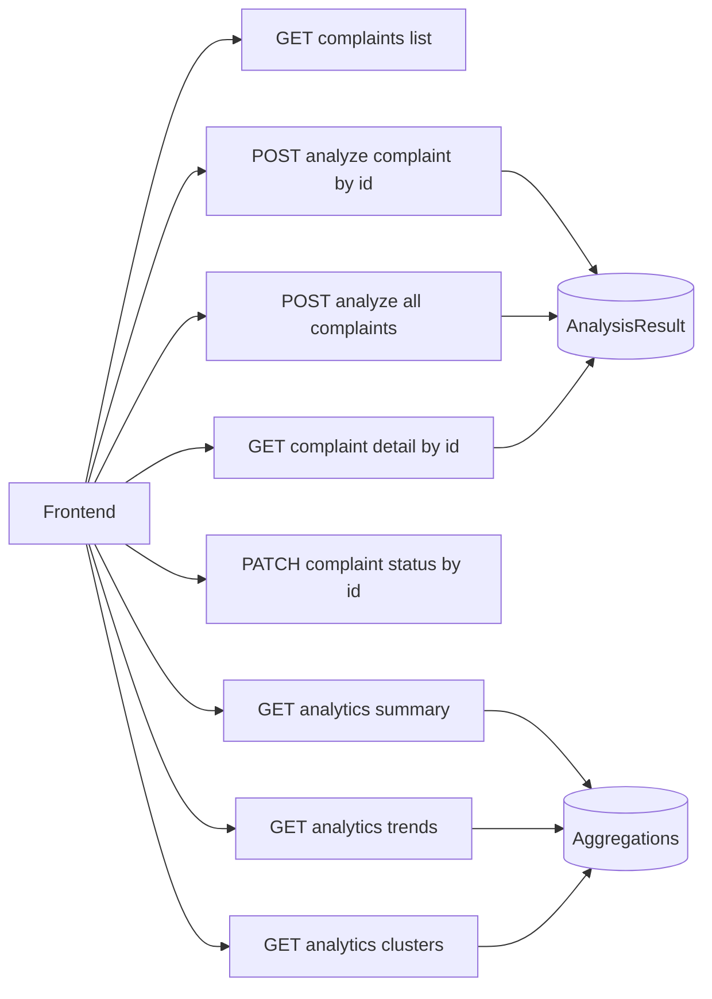

[Back to README](../../README.md)

# API Reference
**This doc lists the main REST endpoints used by the frontend and shows simple request/response examples.**

Base path: `/api`
Swagger UI: `http://localhost:8000/api/docs`

## Endpoint map



## Complaints

### GET `/api/complaints/`
List complaints, with optional filters.

Query params:
- `priority`
- `status`
- `channel`

Example:
```bash
curl "http://localhost:8000/api/complaints/?status=Open&priority=High"
```

### GET `/api/complaints/{complaint_id}/`
Get one complaint with optional analysis payload.

Example:
```bash
curl "http://localhost:8000/api/complaints/<uuid>/"
```

### POST `/api/complaints/{complaint_id}/analyze/`
Run AI analysis for one complaint.

Example:
```bash
curl -X POST "http://localhost:8000/api/complaints/<uuid>/analyze/"
```

### POST `/api/complaints/analyze-all/`
Run analysis for all complaints.

Example:
```bash
curl -X POST "http://localhost:8000/api/complaints/analyze-all/"
```

### PATCH `/api/complaints/{complaint_id}/status/`
Update complaint status.

Body:
```json
{
  "status": "In Progress"
}
```

Example:
```bash
curl -X PATCH "http://localhost:8000/api/complaints/<uuid>/status/" \
  -H "Content-Type: application/json" \
  -d '{"status":"In Progress"}'
```

## Analytics

### GET `/api/analytics/summary/`
Returns counts used by KPI cards and category/priority breakdown charts.

### GET `/api/analytics/trends/`
Returns day-wise complaint counts.

### GET `/api/analytics/clusters/`
Returns duplicate cluster summaries and counts.

## Response shape notes
- Complaint IDs are UUIDs.
- Analysis fields can be empty when not analyzed yet.
- Status values should follow the backend enum values.
