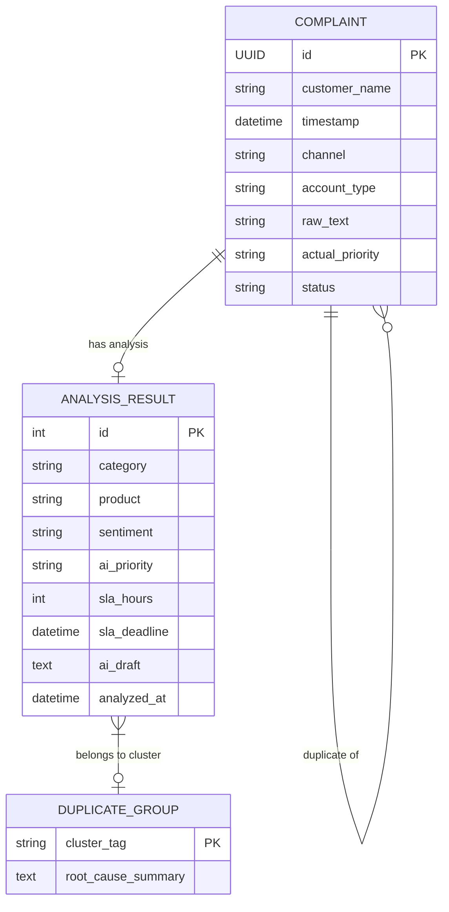

# Backend Architecture

The SamvadAI backend is built strictly for high performance and rapid development using the following stack:

- **Django 5**: Core framework and ORM (SQLite).
- **Django-Ninja**: Fast API routing with Pydantic schema validation.
- **LangChain & LangGraph**: Agentic AI orchestration for processing complaint pipelines.

## Data Models & ER Diagram
The SQLite schema is optimized for lookup speed and historical traceability.

## API Endpoints
All endpoints are mounted under `/api/`. For an interactive swagger interface, start the server and visit `/api/docs/`.
