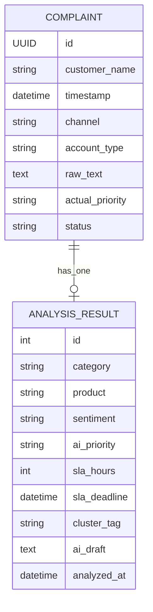

[Back to README](../../README.md)

# Backend Architecture
**This doc explains how the Django backend stores complaints, exposes APIs, and runs AI analysis.**

## Stack
- Django
- Django-Ninja (REST API + schema validation)
- SQLite (local demo DB)
- LangGraph pipeline integration

## Main backend folders
- `apps/api/api/` — Django project config (`settings.py`, `urls.py`).
- `apps/api/complaints/` — models, schemas, API routes, pipeline logic.
- `apps/api/complaints/management/commands/` — seed scripts.

## Data model (high level)



## API routing
All API endpoints are mounted under `/api/` using Django-Ninja.

- Complaint routes: listing, detail, analyze single, analyze all, status update.
- Analytics routes: summary, trends, clusters.

See full endpoint details in [API Reference](api-reference.md).

## Local run commands

```bash
cd apps/api
uv sync
uv run python manage.py migrate
uv run python manage.py seed_complaints
uv run python manage.py runserver 0.0.0.0:8000
```

## Known limitations
- Bulk analysis is currently synchronous in the API path.
- Production security settings need stricter environment setup.
- More tests are needed around pipeline edge cases.
