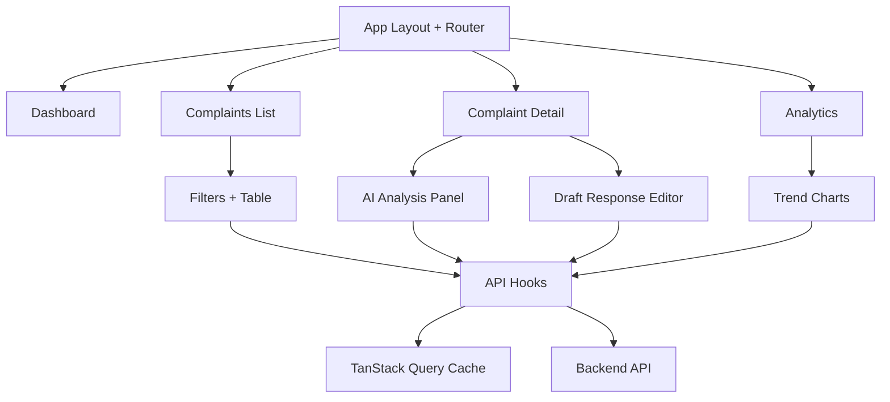

[Back to README](../../README.md)

# Frontend Architecture
**This doc explains how the React app is structured and how data flows from API to UI.**

## Stack
- React + Vite + TypeScript
- shadcn/ui + Tailwind CSS
- TanStack Query (server state)
- Zustand (client/workflow state)
- Recharts (analytics visualizations)

## Feature areas
- **Dashboard**: KPI cards + snapshot charts.
- **Complaints**: table with filtering.
- **Complaint Detail**: full complaint context + AI analysis + draft editor.
- **Analytics**: trend and clustering views.

## Frontend module map



## Data flow
1. Page loads.
2. Hook calls API through shared `fetcher`.
3. Query cache stores response.
4. Components render table/cards/charts.
5. User actions trigger mutation endpoints and invalidate stale queries.

## Page-level behavior
- Complaints list supports filter-based fetch.
- Detail page retrieves complaint + analysis data.
- Analyze actions call backend and refresh local state.
- Analytics page reads summary/trend/cluster endpoints.

## Local run commands

```bash
cd apps/web
npm install
npm run dev
```

## Practical improvements to consider
- Better loading skeletons and empty states.
- Consistent status/priority color mapping across all pages.
- User-friendly retry UI for failed API calls.
