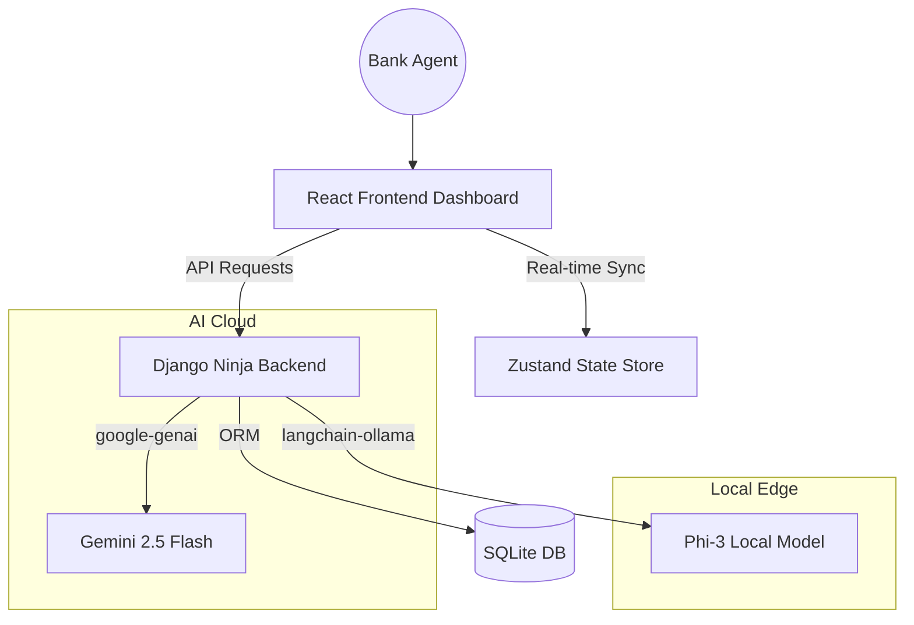

# SamvadAI Documentation

Welcome to the internal documentation for SamvadAI, the advanced Gen-AI powered complaint resolution and analytics platform for Union Bank.

## System Architecture

## Project Overview
This repository contains the complete source code for:
- **`apps/api`**: Django 5 + Ninja + LangGraph API backend.
- **`apps/web`**: Vite + React 19 + shadcn/ui frontend dashboard.
- **`shared`**: Cross-platform TypeScript logic and React primitives.
- **`scripts`**: Automation bash scripts for rapid setup.

## What We Built

SamvadAI was built to prove that enterprise banking can leverage cutting-edge Gen-AI securely.
1. **Agentic Pipeline**: We didn't just build a wrapper; we built a deterministic **5-node LangGraph** state machine. Each complaint is routed through distinct AI logic steps (Classify -> Sentiment -> SLA -> Duplicate Detect -> Draft).
2. **On-Device Edge AI**: We integrated **Phi-3 via Ollama**, proving that the bank does not have to send sensitive customer financial data to external cloud providers. The entire app can run fully air-gapped using local hardware.
3. **Optimized Frontend Batching**: To protect the local Ollama LLM from being overwhelmed by concurrent requests, we built a React-based **Zustand loop** that chunks batch requests sequentially, updating a live progress bar.

## Future Roadmap

While the hackathon demo is complete, the architecture is designed to scale with these future additions:
1. **React Native Mobile App**: Using the `shared/` package, agents and branch managers can have a native mobile experience to approve complaint drafts on the go.
2. **WebSocket Live Analysis**: Connecting Django Channels to the React dashboard to stream AI analysis progress token-by-token directly into the UI.
3. **Advanced RAG integration**: Currently, drafts are based on general tone. We plan to insert a vector database (like Qdrant or ChromaDB) loaded with Union Bank's exact policy PDFs, ensuring the AI cites actual bank clauses when drafting refunds.
4. **Automated Sending**: Connecting the "Approve & Send" button directly to the bank's SMTP server / WhatsApp Business API to execute the resolution immediately.
