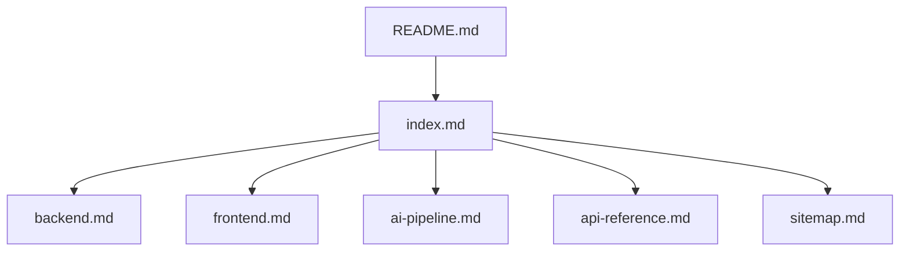

[Back to README](../../README.md)

# Documentation Sitemap
**This page is a quick map of every documentation page in this project.**

## Visual map

## Start here
- [Docs Home](index.md) — Project overview and architecture at a glance.

## Architecture
- [Backend Architecture](backend.md) — Backend components, models, and server behavior.
- [Frontend Architecture](frontend.md) — UI modules and client-side data flow.
- [AI Pipeline](ai-pipeline.md) — Pipeline steps and model strategy.

## Integration
- [API Reference](api-reference.md) — Endpoints and payload examples.

## Repository entry point
- [Main README](../../README.md) — Setup, quickstart, and full docs index.
